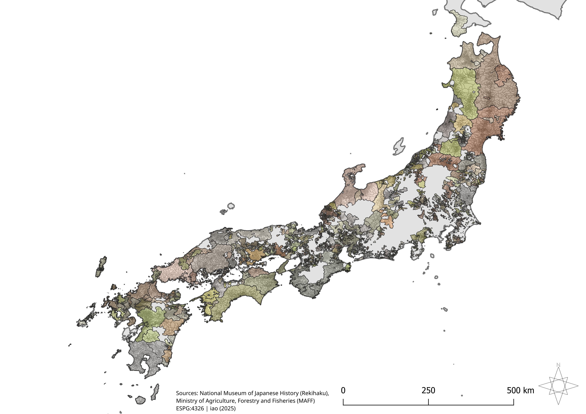

## Reconstructed Domain Boundaries Data from the End of the Edo Period

This dataset is in the public domain (CC0)

**Sample GPKG:** [Akita](sample-data/Akita_出羽秋田藩.gpkg)

**Full dataset:** see the [latest release](../../releases/latest).

## Citation
iao (2025). Edo Domains (c. 1862): Geospatial dataset (v0.1) [Data set; GeoPackage (GPKG); EPSG:4326]. Zenodo. https://doi.org/10.5281/zenodo.17139791

------------
## Background

This repository provides open historical GIS boundary data for **Edo-period domains (藩, han)** around **1862** for public use. It builds on the work of GitHub user [yaoyue00085856](https://github.com/yaoyue00085856), who processed the 旧高旧領取調帳データベース (*Kyūdaka–Kyūryō–Torishirabechō Database*), a dataset from the National Museum of Japanese History containing domain and village-level information. Please refer to their linked GitHub page to view source data and information on source data.

The Edo period of Japan (1603–1868) was hallmarked by the Tokugawa shogunate, a centralized military government that oversaw a feudal domain system. This system permitted individual lords, or *daimyō*, to control quasi-autonomous domains defined by their holdings of villages (*fiefs*) and the amount of rice (*koku*) they produced. Because domains were defined both by spatial extent and by productive capacity, mapping them requires consideration of both geographic boundaries and *kokudaka*.

The lowest country-covering administrative subdivision of the period was the district (郡, gun) itself a subdivision of provinces (国, kuni).
Cadastral data of the Edo period was not recorded within the epistemological framework of modern geodetic science. As a result, a contemporary proxy must be utilized to approximate a polygonal analogue to the villages of the Edo Period. The most suitable proxy, as identified by [yaoyue00085856](https://github.com/yaoyue00085856), is the **Agricultural Settlement Boundary** dataset from the [*2015 Agriculture and Forestry Census*](https://www.maff.go.jp/j/tokei/census/shuraku_data/2015/ma/index.html).

This repository introduces a database that includes geopackages for every single domain that existed during the late Tokugawa period. This includes the **Matsumae Domain (Hokkaidō)**, which lacks village-level representation in the *Kyūdaka–Kyūryō–Torishirabechō* Database. Matsumae holdings were manually delineated using the Agricultural Settlement Boundary dataset from the 2015 Agriculture and Forestry Census, guided by local sources describing its extent in the final years of the Tokugawa shogunate. These data can be used to map Edo period domains with reasonable accuracy. Although some territorial changes occurred throughout the Edo Period, they were generally infrequent and relatively minor after the late 17th century [(Fukumoto & Shizume, 2025, p. 4)](https://www.waseda.jp/fpse/winpec/assets/uploads/2025/02/166a4251118d5dd1726cbc35521234de.pdf). This data also introduces *kokudaka* values for each domain, sourced from [Tonbiwing.com](https://tonbiwing.com). 

Future research on Edo-period domains could investigate village-level kokudaka as listed in the *Kyūdaka–Kyūryō–Torishirabechō Database*. Such research could illuminate the economic and political weight of individual villages and provide historiographical context for the discontinuous nature of domain holdings. All sources used for this project will be cited at the bottom of this document.

## 背景

本リポジトリは、**江戸時代末期（約1862年）の藩境界のGISデータ**を公開するものです。GitHubユーザー [yaoyue00085856](https://github.com/yaoyue00085856) による旧高旧領取調帳データベースの前処理に基づいています。同データベースは国立歴史民俗博物館が公開するもので、藩および村単位の情報を含みます。詳細は yaoyue00085856 の GitHub ページを参照してください。

当時、全国に共通する最下位の行政区画は **郡** で、**国** の下位区分でした。江戸期の検地・地籍資料は現代の測地学的手法で記録されていないため、当時の村をポリゴンで近似するには現代の代替データが必要です。最適な近似として [農林業センサス 2015 年 集落境界データ](https://www.maff.go.jp/j/tokei/census/shuraku_data/2015/ma/index.html) が挙げられます（[yaoyue00085856](https://github.com/yaoyue00085856) の指摘）。

本リポジトリでは、幕末期に存在したすべての藩に対応するジオパッケージを提供します。**松前藩（北海道）**も含まれます。同藩は *旧高旧領取調帳データベース* に村単位の情報が収録されていないため、2015年農林業センサスの**集落境界データ**を用い、幕末期における領域を示す史料を参照して手作業で境界を画定しました。
これらのデータにより、江戸期の藩境界を比較的正確に可視化できます。江戸期を通じて領地の変動は一定程度あったものの、17 世紀後半以降の変化は比較的少なかったことが示されています [(Fukumoto & Shizume, 2025)](https://www.waseda.jp/fpse/winpec/assets/uploads/2025/02/166a4251118d5dd1726cbc35521234de.pdf)。また、藩ごとの石高も付与しており、[Tonbiwing.com](https://tonbiwing.com) に基づいています。

今後の研究としては、旧高旧領取調帳データベースに記載された **村単位の石高** を分析し、個々の村の経済的・政治的重要性を明らかにするとともに、藩領の不連続性を歴史学的文脈に位置づけることが考えられます。

 
- **Coverage**: 266 domains (藩)
- **Format**: GeoPackage (`.gpkg`) 
- **Coordinate system**: EPSG:4326 (WGS84)

------------

## Data Fields

**edo-domains field metadata**  
each domain will contain the same fields except for matsumae domain which contains fields from both Rekihaku and MAFF

| field name (jp) | field name (eng) | data type | desc | notes |
|---|---|---|---|---|
| wkt_geom | wkt_geom | multipolygon | domain or village geometry | EPSG:4326 |
| fid | fid | integer64 | unique features id | generated automatically |
| 藩名 | han name | text (string) | official name of the domain (with province if needed) | if multiple han share name then province is added as prefix |
| AID | AID | text (string) | unique polygon id | from agricultural polygon proxy |
| 国ID | province id | text (string) | unique province id | from rekihaku village data |
| 国名 | province name | text (string) | name of the province (旧国名) | from rekihaku village data |
| 郡名 | district name | text (string) | name of the district | from rekihaku village data |
| 村名 | village name | text (string) | village name | from rekihaku village data |
| よみ | kana reading | text (string) | Kana transcription of village name | from rekihaku village data, includes some null values |
| 藩名ローマ字 | han romaji | text (string) | romanized domain name | hepburn-style, from rekihaku village data |
| 和英併記 | jp-en combined | text (string) | combined field: `<jp>_<en>` | helpful for lookups |
| 藩石高(万石) | kokudaka | integer | nominal kokudaka, domain-level, in 万石 (10,000 koku units) | values do not match village |

---

## edo-domains フィールドメタデータ
各藩データには同じフィールドが含まれます

| フィールド名 (jp) | フィールド名 (eng) | データ型 | 説明 | 備考 |
|---|---|---|---|---|
| wkt_geom | wkt_geom | マルチポリゴン | 藩または村のジオメトリ | EPSG:4326 |
| fid | fid | 整数64 | ユニークなフィーチャーID | 自動生成 |
| 藩名 | han name | テキスト | 藩の正式名称（必要に応じて国名付き） | 同名の藩がある場合は国名を接頭に追加 |
| AID | AID | テキスト | ポリゴンのユニークID | 農業集落境界データより |
| 国ID | province id | テキスト | 国のユニークID | 国立歴史民俗博物館「旧高旧領取調帳DB」より |
| 国名 | province name | テキスト | 国の名称（旧国名） | 同上 |
| 郡名 | district name | テキスト | 郡の名称 | 同上 |
| 村名 | village name | テキスト | 村の名称 | 同上 |
| よみ | kana reading | テキスト | 村名の仮名表記 | 一部NULL |
| 藩名ローマ字 | han romaji | テキスト | 藩名のローマ字表記 | ヘボン式 |
| 和英併記 | jp-en combined | テキスト | `<jp>_<en>` の結合フィールド | ルックアップ用 |
| 藩石高(万石) | kokudaka | 整数 | 藩の名目石高（万石＝10,000石） | 村単位とは一致しない場合あり |

------------

## How to Use
1. Download the dataset.  
2. Open in QGIS, ArcGIS, or any GIS software that supports GeoPackage.  
3. Use attribute filtering to explore specific domains.  

(The compressed file containing all gpkgs is 155MB)

------------

## Sources

*Primary data sources used for this project -*

1. Ministry of Agriculture, Forestry and Fisheries (MAFF). “農業集落境界データ [Agricultural Settlement Boundary Data] (2015 農林業センサス基準).” MAFF Statistics
https://www.maff.go.jp/j/tokei/census/shuraku_data/2015/ma/index.html

2. National Museum of Japanese History (Rekihaku). “旧高旧領取調帳データベース [Kyudaka–Kyūryō–Torishirabechō Database].”
https://www.rekihaku.ac.jp/doc/gaiyou/kyuudaka.html

3. Yaoyue (yaoyue00085856). “Kyudaka_agrivillage” GitHub.
https://github.com/yaoyue00085856/Kyudaka_agrivillage/blob/master/README.md

*The following source was used to derive kokudaka metadata -*

1. TonbiWing. “全藩一覧表 [List of All Domains]—文久2年基準.” トンビが見た江戸の町.
https://tonbiwing.com/map/jpn00-zenkoku/han-list/

*The following sources were used to inform curation of Matsumae holdings in Ezochi -*

1. 知内町教育委員会 (Shiriuchi Town Board of Education). “建有川寨門跡 [Saimon Gate Remains, Tate-Arikawa].”
https://www.town.shiriuchi.hokkaido.jp/kyoiku/shakai/kyodo/shisetsu/saimonato.html

2. 福島町教育委員会 (Fukushima Town Board of Education). “福島町史 第二巻 通説編(上)・第四編第一章第一節（四）—『幕末の松前藩─蝦夷地の上地と三万石格大名』.”
https://www.town.fukushima.hokkaido.jp/kyouiku/%E7%A6%8F%E5%B3%B6%E7%94%BA%E3%81%AE%E6%96%87%E5%8C%96%E8%B2%A1/%E7%A6%8F%E5%B3%B6%E7%94%BA%E5%8F%B2%E7%AC%AC%E4%BA%8C%E5%B7%BB%E9%80%9A%E8%AA%AC%E7%B7%A8%E4%B8%8A/%E7%AC%AC%E5%9B%9B%E7%B7%A8%E7%AC%AC%E4%B8%80%E7%AB%A0%E7%AC%AC%E4%B8%80%E7%AF%80%EF%BC%88%E5%9B%9B%EF%BC%89/

3. Fujiwara, Gideon. Spirits and Identity in Nineteenth-Century Northeastern Japan: Hirata Kokugaku and the Tsugaru Disciples. PhD diss., University of British Columbia, 2013. UBC Open Collections
https://open.library.ubc.ca/media/stream/pdf/24/1.0073793/2

4. 厚沢部町教育委員会 (Assabu Town Board of Education). “館城跡～日本最後の和式築城～ [Tate Castle Ruins—Japan’s Last Japanese-Style Castle].”
https://www.town.assabu.lg.jp/page/1369.html

(In 1855, the shogunate assumed direct control of Hakodate, along with the northern and the eastern territories of Ezo which had been previously under the authority of the Matsumae clan. In compensation, the Matsumae clan were rewarded holdings in Mutsu province and retained jurisdiction over the western coastal areas of the Oshima peninsula. As this dataset seeks to represent the final configuration of domain boundaries, the territories transferred to the shogunate are not included in the Matsumae holdings.)

「1855年、幕府は松前氏の支配下にあった函館および蝦夷地の北部・東部を直轄とした。その代償として、松前氏には陸奥国での領地が与えられ、渡島半島西岸の支配権も保持された。本データセットは最終的な藩境の構成を示すことを目的としているため、幕府直轄に移された領地は松前藩領として含めていない。」

In order to ensure source preservation in the event of future link rot, all of the above sources are archived on the Wayback Machine. 
https://web.archive.org/web/*/https://www.maff.go.jp/j/tokei/census/shuraku_data/2015/ma/index.html
https://web.archive.org/web/*/https://www.rekihaku.ac.jp/doc/gaiyou/kyuudaka.html
https://web.archive.org/web/*/https://github.com/yaoyue00085856/Kyudaka_agrivillage/blob/1936ee0f7ca9c98bba4a2acea939851b0ff073bd/README.md
https://web.archive.org/web/20250000000000*/https://tonbiwing.com/map/jpn00-zenkoku/han-list/
https://web.archive.org/web/*/https://www.town.shiriuchi.hokkaido.jp/kyoiku/shakai/kyodo/shisetsu/saimonato.html
https://web.archive.org/web/*/https://www.town.fukushima.hokkaido.jp/kyouiku/%E7%A6%8F%E5%B3%B6%E7%94%BA%E3%81%AE%E6%96%87%E5%8C%96%E8%B2%A1/%E7%A6%8F%E5%B3%B6%E7%94%BA%E5%8F%B2%E7%AC%AC%E4%BA%8C%E5%B7%BB%E9%80%9A%E8%AA%AC%E7%B7%A8%E4%B8%8A/%E7%AC%AC%E5%9B%9B%E7%B7%A8%E7%AC%AC%E4%B8%80%E7%AB%A0%E7%AC%AC%E4%B8%80%E7%AF%80%EF%BC%88%E5%9B%9B%EF%BC%89/
https://web.archive.org/web/*/https://open.library.ubc.ca/media/stream/pdf/24/1.0073793/2
https://web.archive.org/web/*/https://www.town.assabu.lg.jp/page/1369.html

------------
Version

v0.1 - September 2025

------------
License

This dataset is released under CC0 (Public Domain Dedication).
You are free to use, modify, and redistribute without restriction.
